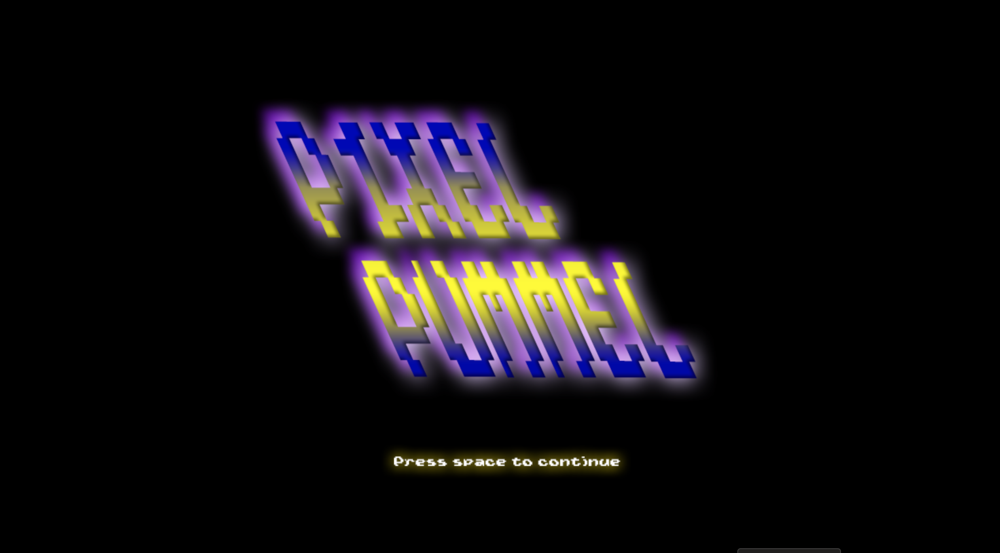

# Pixel Pummel 8-Bit Street Fighter Game

## Introduction
Welcome to Pixel Pummel, the ultimate 8-bit street fighter game that will take you on a nostalgic journey to the golden age of arcade gaming! In Pixel Pummel, you'll step into the shoes of unique fighters and test your skills and strategy against formidable opponents.

## Requirements
- Python 3 or greater
- Pygame Library

## Installation
1) Clone the GitHub Repository using either https or SSH
2) Open project folder
3) Double click PixelPummel.exe
4) Play!

## Contributions
Created by: Parker Thompson, Mason Russo, Tori Lee, Jacob Sonn

